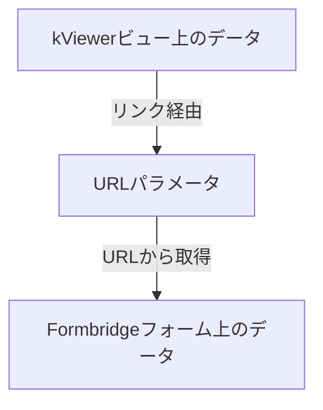

# kvcust-prefilled-formlink

## 概要
- kintoneの連携サービスであるkViewer及びFormbridge向けカスタマイズのひな形です。
- kViewerのビュー上で表示しているデータを引き継いで、Formbridgeのフォーム上で初期値として表示させます。
  - 同一アプリのレコード更新については、kViewerとFormbridgeの標準機能で、ビューのデータをフォームに引用可能ですが、本カスタマイズでは任意のビュー／フォーム間でのデータの連携を設定可能です。
- データの連携には、URLパラメータを利用しています。利用者の環境によっては、情報がプロキシサーバのログとして残るなどが起こり得ますので、機微な情報は含めない等を考慮してください。
- 本カスタマイズは、2024年9月17日にリリースされたバージョンのkViewer及び2025年2月4日にリリースされたバージョンのFormbridgeでの動作確認を行っています。旧バージョンでは動作しない可能性がありますが、ご了承ください。
- 本カスタマイズでは、テーブルデータの連携にも対応しています。

## 構成
- ２つのjavascriptで構成されます。
  - /src/kv-index.js
    - kViewer用のカスタマイズです。
  - /src/fb-index.js
    - Formbridge用のカスタマイズです。
- javascriptで記述しています。
  - 小規模のプログラムで設定を簡便に行えることを主眼としており、typescriptは採用していません。

## 設定方法

### 動作概要
本カスタマイズでは、URLパラメータを用いてビュー➔フォーム間でのデータ連携を行います



このため、設定はkViewerとFormbridgeの２箇所で行います。

### kv-index.jsの設定

- 対象ファイルは./src/kv-index.jsです
- ファイル内の設定項目の箇所を編集し、URLパラメータに引き渡す内容を設定します
- 設定できたら、カスタマイズ対象のビューに、javascriptを設定してください

```javascript
  /***************************************
   * 設定項目　ここから
   ***************************************/
  // FrombridgeのURL
  const FORM_URL =
    "https://6c1e671f.form.kintoneapp.com/public/44eb68cf0fc247e5a22ee604b8892b659a1b4f9f4c2a28e782586dbd6cffb6b6";

  // 項目のマッピング設定
  //  viewItem: kViewerのフィールドコード
  //  paramName: URLパラメータとして設定する項目名
  const MAPPINGS = [
    { viewItem: "案件名", paramName: "pAnName" },
    { viewItem: "案件番号", paramName: "pAnNo" },
    { viewItem: "案件番号", paramName: "pAnNo" },
  ];

  // テーブル項目のマッピング設定
  //  paramName: URLパラメータとして設定する項目名
  //  mappings: テーブルのマッピング設定（複数テーブルに係る設定の配列）
  //    viewItem: kViewer上のテーブルのフィールドコード
  //    paramTable: URLパラメータ中の対応するテーブル名
  //    columnMappings: 各列のマッピング設定
  //      viewColumn: kViewer上のテーブル列のフィールドコード
  //      paramColumn: URLパラメータ中の対応するテーブル列名
  const TABLE_MAPPINGS = {
    // パラメータ名　※項目のマッピング設定で使用した名称と重複しないようにしてください
    paramName: "pTables",
    mappings: [
      // １つ目のテーブル設定
      {
        viewItem: "質疑",
        paramTable: "pQuestions",
        columnMappings: [
          { viewColumn: "質問", paramColumn: "pQuestion" },
          { viewColumn: "備考", paramColumn: "pMemo" },
        ],
      },
      // ２つ目のテーブル設定
      {
        viewItem: "質疑2",
        paramTable: "pQuestions2",
        columnMappings: [
          { viewColumn: "質問2", paramColumn: "pQuestion2" },
          { viewColumn: "備考2", paramColumn: "pMemo2" },
        ],
      },
    ],
  };

  // リンク設置用スペースのフィールドコード
  const SPACE_FOR_LINK = "spaceField";

  // リンクの表示テキスト
  const LINK_TEXT = "質疑フォームへ";

  // リンクを自タブで開く"_self" or 新しいタブで開く "_blank"
  const LINK_TARGET = "_blank";

  // リンクの表示スタイル
  const LINK_STYLE =
    "text-decoration: underline; color: royalblue; font-size: 1.5rem;";

  /***************************************
   * 設定項目　ここまで
   ***************************************/
```

### fb-index.jsの設定

- 対象ファイルは./src/fb-index.jsです
- ファイル内の設定項目の箇所を編集し、URLパラメータから受け取って、フォームに引き渡す内容を設定します
- 設定できたら、カスタマイズ対象のフォームに、javascriptを設定してください

```javascript
  /***************************************
   * 設定項目　ここから
   ***************************************/
  // 項目のマッピング設定
  //  paramName: URLパラメータの項目名
  //  formItem: Frombridge上のフィールドコード
  const MAPPINGS = [
    { paramName: "pAnName", formItem: "案件名" },
    { paramName: "pAnNo", formItem: "案件番号" },
    { paramName: "pAnName", formItem: "anName" },
    { paramName: "pAnNo", formItem: "anNo" },
  ];

  // テーブル項目のマッピング設定
  //  paramName: URLパラメータの項目名
  //  mappings: テーブルのマッピング設定（複数テーブルに係る設定の配列）
  //    formItem: Frombridge上のテーブルのフィールドコード
  //    paramTable: URLパラメータ中の対応するテーブル名
  //    columnMappings: 各列のマッピング設定
  //      formColumn: Frombridge上のテーブル列のフィールドコード
  //      paramColumn: URLパラメータ中の対応するテーブル列名
  const TABLE_MAPPINGS = {
    // パラメータ名　※項目のマッピング設定で使用した名称と重複しないようにしてください
    paramName: "pTables",
    mappings: [
      // １つ目のテーブル設定
      {
        formItem: "質疑",
        paramTable: "pQuestions",
        columnMappings: [
          { formColumn: "質問", paramColumn: "pQuestion" },
          { formColumn: "備考", paramColumn: "pMemo" },
        ],
      },
      // ２つ目のテーブル設定
      {
        formItem: "質疑2",
        paramTable: "pQuestions2",
        columnMappings: [
          { formColumn: "質問2", paramColumn: "pQuestion2" },
          { formColumn: "備考2", paramColumn: "pMemo2" },
        ],
      },
    ],
  };

  /***************************************
   * 設定項目　ここまで
   ***************************************/
```